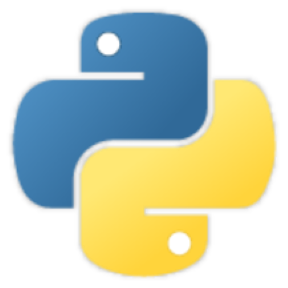
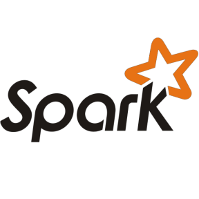
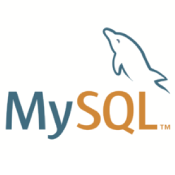
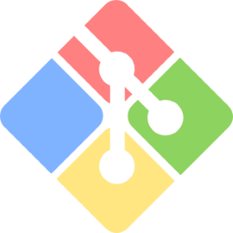

# Hi I'm David! Welcome to My GitHub Portfolio

- ⚙ I’m currently working on several personal projects to build out my portfolio
- 👨‍🎓 Education:

> 
>        - Honours BSc Graduate in Health Sciences (Epidemiology/Statistics) from Brock University
>        - Diploma Graudate in Data Science from BrainStation
>
>        - Master of Music (Opera Performance) from the University of Toronto
>        - Honours Bachelor of Music (Vocal Performance) from Western University (UWO)

- 👓 I'm currently looking for work

>        - Toronto, Canada 🍁
>        - Berlin, Germany 🍺
>        - Open to Remote Work 💻

- 📫 How to reach me: davidjdiston@gmail.com / [LinkedIn](https://www.linkedin.com/in/daviddiston/)
- ⚡ Fun fact: I am a former Opera Singer (baritone), and have performed for audiences across North America and Europe 🎵

 

## Skills and Tools:

 
 
 

## GitHub Activity

Joined GitHub August 6th 2020
<!--
**ddiston/ddiston** is a ✨ _special_ ✨ repository because its `README.md` (this file) appears on your GitHub profile.

Here are some ideas to get you started:

- 🔭 I’m currently working on ...
- 🌱 I’m currently learning ...
- 👯 I’m looking to collaborate on ...
- 🤔 I’m looking for help with ...
- 💬 Ask me about ...
- 📫 How to reach me: ...
- 😄 Pronouns: ...
- ⚡ Fun fact: ...
-->
